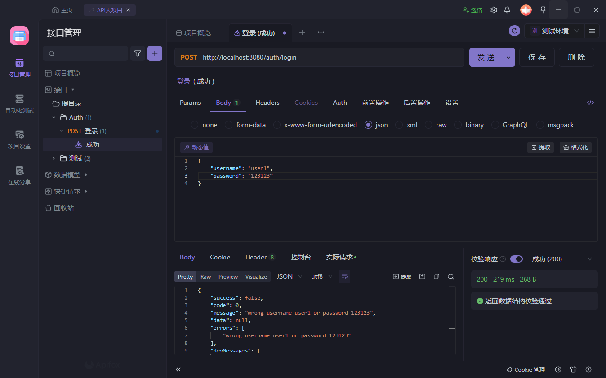
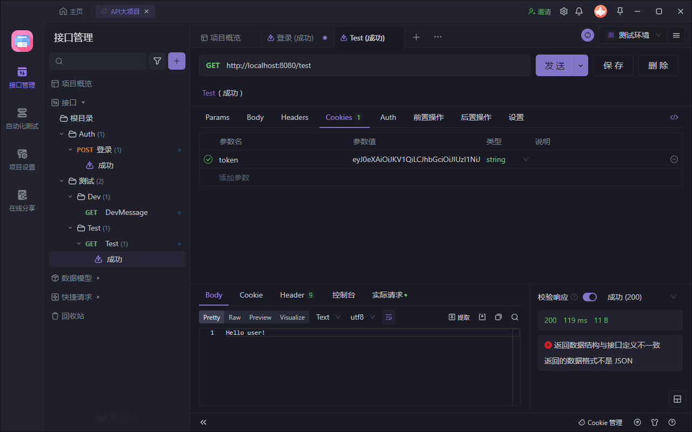
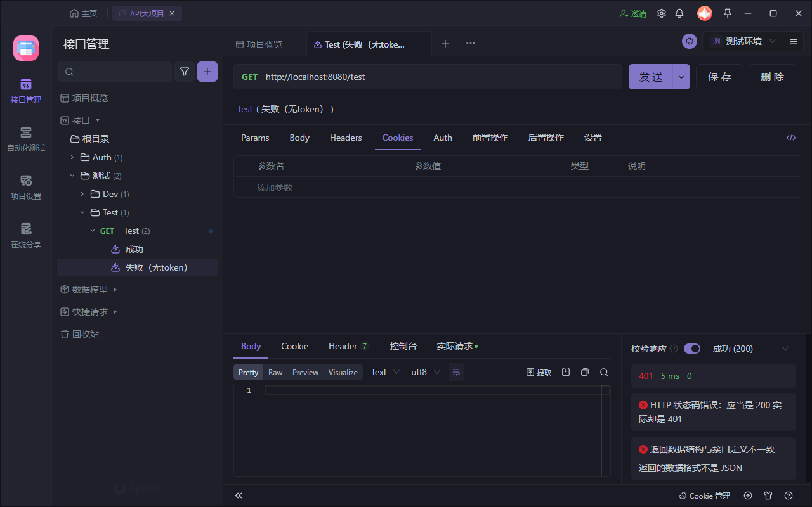

# API

## 控制器Controller

```java
@RestController
@RequestMapping("/auth")
@Slf4j
public class AuthController {

    @PostMapping("/login")
    @NotNull
    public Result login(@RequestBody @NotNull LoginDomain loginDomain, HttpServletResponse response) {
        return Result.success();
    }
}

public class Result {
    private boolean success;
    private String message;
    private Object data;
    // ...
}

public class LoginDomain {
    private String username;
    private String password;
}
```

- `@RequestMapping("/auth")`和`@PostMapping("/login")`表示访问`login()`的相对路径为
`/auth/login`
- 参数`LoginDomain`是请求体
- 返回值`Result`是响应体

## ApiFox测试

- 如下所示，请求体`{"username": "user1","password": "123123"}`作为`LoginDomain`被传入`login()`，而`Result`返回被解析成响应体中的
`{"success": false,"message": "wrong username user1 or password 123123","data": null,...}`



- 在涉及用户权限的检查时，需要在`Cookie`中加入`token`



- 没有`token`时，会被拦截，返回`401 UNAUTHORIZED 未授权`



# 数据库

> 以用**户查询消费记录**为例子

## 数据库关系

    [User] <-1-- <Purchasing> --1--> [Commodity]

> **注意**，`User实体`和`Commodity实体`是多对多关系，
> 但是，`User实体`和`Purchasing关系`是一对一，`Commodity实体`和`Purchasing关系`是一对一。
> 这是后面的`@OneToOne`的由来。

## Access 实体Entity/关系Relation类实现


```java
@Entity
@Table(name = "t_User")
public class User {
    @Id
    String name;
    String password;
    @Builder.Default
    Gender gender = Gender.Unknown;
}
```

- `@Id`是标明主键。

- 加上`@Table(name = "t_User")`是为了防止表名和关键字冲突，
不加的话，默认为类名，即`User`，而数据库大多有`user`关键字。

```java
@Entity
@Table(name = "t_Commodity")
public class Commodity {
    @Id
    @GeneratedValue(strategy = GenerationType.AUTO)
    Integer id;
    String name;
    Float price;
    Float rating;
    String details;
}
```

- `@GeneratedValue(strategy = GenerationType.AUTO)`为自动生成主键，
本项目除`User`使用`name`作为主键外，其余均使用`@Id @GeneratedValue(strategy = GenerationType.AUTO) Integer id;`作为主键

```java
@Entity
@Table(name = "t_Purchasing")
public class Purchasing {
    @Id
    @GeneratedValue(strategy = GenerationType.AUTO)
    Integer id;
    @OneToOne
    User user;
    @OneToOne
    Commodity commodity;
}
```

- 更多信息参照网上的Spring JPA
